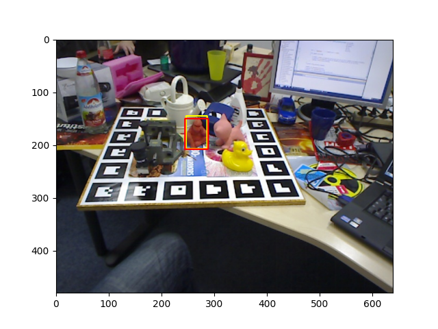

# Deep Template-based Object Instance Detection

This repository makes it possible to run our network for the Linemod dataset. Our paper is available online here (https://arxiv.org/abs/1911.11822) and has been published in WACV 2021. 

## Prerequisites
Our approach has been developed/tested on Pytorch 0.4.1 and Python 3.6.2 and has not been tested with other setups. In this case, for compatibility problems between CUDA and Pytorch, we test under different conditions and it may not yield the same results as in our submission.

## Instructions

### Step 1
Download the model file with from this [Link](https://drive.google.com/file/d/1C6q2ivDPCL6H8MIA8ZInaiRUE1-V9Nr6/view?usp=sharing). The model should be placed in the root directory and named "model.pth.tar".

### Step 2 (optional)
You can generate a virtual python environment (if you do not want to mess up your actual one) with the following commands:
```
python3 -m pip install --user virtualenv
python3 -m venv env
source env/bin/activate
```

### Step 3
Install required python modules with the following command:
```
pip3 install -r requirements.txt
```

## Step 4
You are now ready to run the network. You may do so by running run.sh. This script will run the model on images from the Linemod Dataset.

To be convenient and remain under the 100MB limit, a sample of 6 images for each object has been added to this repository. More images can be dowloaded from [here](https://bop.felk.cvut.cz/datasets/) if needed. By default, the run script will iterate over all objects. The script can be modified to run only for a specific object. Also, before each sequence, the 160 templates are loaded into the GPU memory.

```
python3 run.py --all_obj % To run for all objects (start with object index 1)
python3 run.py --obj_id 1 % obj_id should be between 1-15, representing a specific object index
```

The program will draw on top of the input image the best prediction for the selected object (yellow) along with the ground-truth (red) as follows:




